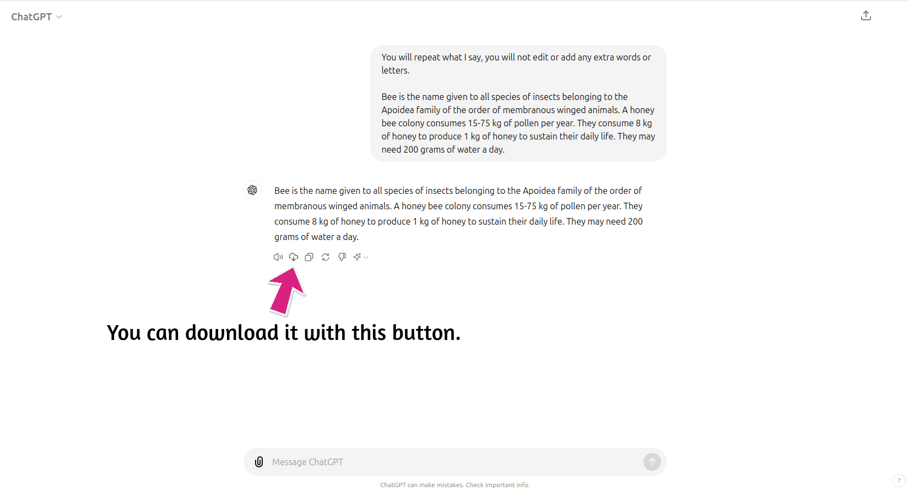

# ChatGPT Sound Downloader 🔊

#### ChatGPT Sound Downloader is a Chrome extension that allows you to download ChatGPT's own voice renderings. This extension enables you to convert ChatGPT-generated texts into audio using your chosen voice and download them.

If you've found this project useful and would like to support its continued development, consider buying me a coffee!

## Screenshots

## Author

- [@miracsengonul](https://www.x.com/miracsengonul)

## 🚀 Features

- 🔊 Convert ChatGPT responses to audio files
- 🎚️ Multiple voice options
- 💨 Quick and easy download process
- 🎨 Sleek and intuitive user interface
- 🔒 Privacy-focused: No data stored on servers

## 🛠️ Installation (Developer Mode)

1. Clone this repository or download it as a ZIP file
2. Go to `chrome://extensions/` in your Chrome browser
3. Enable the "Developer mode" toggle in the top right corner
4. Click on "Load unpacked"
5. Select the downloaded folder and click "Select"

## 🔧 How to Use

1. Select your preferred voice from the dropdown menu
2. Navigate to [ChatGPT](https://chatgpt.com/)
3. Generate your desired text
4. Click the download icon that appears next to the "Read Aloud" icon
5. And enjoy your audio file!

## 🎙️ Supported Voices

| |  |  |
| :-------- | :------- | :--------------------
| Cove | Juniper | Sky |
| Breeze | Shimmer | Santa |

## 🎵 Supported Audio Format

- AAC

## 📝 License

This project is licensed under the MIT License.

## 📞 Support

Having issues or want to suggest a feature? [Open an issue](https://github.com/miracsengonul/chatgpt-sound-downloader/issues)

## 🌟 Show Your Support

If you find this extension helpful, please consider giving it a star on GitHub!

---

Made with ❤️ by Mirac
